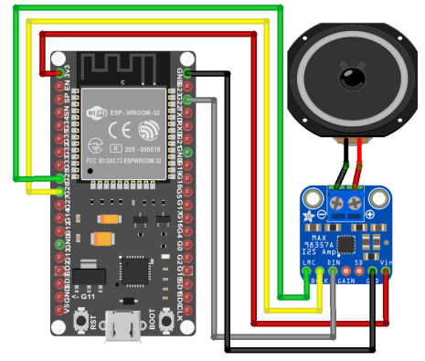

# PRACTICA 7 :  Buses de comunicación III (I2S) 

El protocolo de comunicación I2S se usa para transferir señales de sonido digitales Nosotros
realizaremos una practica para reproducir música desde la memoria interna, así como desde
una tarjeta SD externa.
También comparamos diferentes microcontroladores y vemos por qué preferimos un
microcontrolador ESP32 para nuestros proyectos I2S.

## **Hardware**
- ESP32
- MAX98357 I2S
  
## **Objetivo**
Los datos de sonido se almacenan como una matriz en la RAM interna del ESP32. Para este primero ejercicio, usaremos la placa de conexión de audio MAX98357 I2S para decodificar la señal digital en una señal
analógica. Por lo tanto, utilizamos el protocolo I2S para generar los datos de sonido digital sin
pérdidas de calidad.
La siguiente imagen muestra el cableado entre el ESP32 NodeMCU, la placa de conexión de
audio MAX98357 I2S y el altavoz.




## **Software y funcionamiento**


### **Cabeccera del código**
Estas líneas importan las bibliotecas necesarias para reproducir un archivo de audio en formato AAC. La biblioteca AudioGeneratorAAC se encarga de decodificar el archivo de audio, AudioOutputI2S se utiliza para reproducir el audio a través de la salida de audio I2S, AudioFileSourcePROGMEM se utiliza para leer el archivo de audio desde la memoria de programa y sampleaac.h es el archivo de audio AAC que se va a reproducir.
```cpp
#include <Arduino.h>

#include "AudioGeneratorAAC.h"
#include "AudioOutputI2S.h"
#include "AudioFileSourcePROGMEM.h"
#include "sampleaac.h"

AudioFileSourcePROGMEM *in;
AudioGeneratorAAC *aac;
AudioOutputI2S *out;

```

### **Estructura del Setup**
La función setup() se ejecuta una vez al inicio del programa. Primero, inicializamos la comunicación serial con una velocidad de 115200 para enviar mensajes de depuración al monitor serie.

Luego, se crean los objetos AudioFileSourcePROGMEM, AudioGeneratorAAC y AudioOutputI2S que se crearon anteriormente. El objeto AudioFileSourcePROGMEM se inicializa con el archivo de audio sampleaac.h. El objeto AudioOutputI2S se inicializa con una ganancia de 0.125 y se configura el pinout a los pines 26, 25 y 22. Finalmente, el objeto AudioGeneratorAAC se inicializa con los objetos AudioFileSourcePROGMEM y AudioOutputI2S.
```cpp
void setup(){
  Serial.begin(115200);

  in = new AudioFileSourcePROGMEM(sampleaac, sizeof(sampleaac));
  aac = new AudioGeneratorAAC();
  out = new AudioOutputI2S();
  out -> SetGain(0.125);
  out -> SetPinout(26,25,22);
  aac->begin(in, out);
}
```
### **- Estructura del Loop**
En la función loop() se verifica si el objeto AudioGeneratorAAC está en ejecución utilizando el método isRunning(). Si el objeto AudioGeneratorAAC está en ejecución, se llama al método loop() del objeto AudioGeneratorAAC para decodificar y reproducir el audio. Si el objeto AudioGeneratorAAC no está en ejecución, se detiene el objeto AudioGeneratorAAC, se imprime un mensaje de depuración en el monitor serie y se espera un segundo(delay(1000)) antes de volver a intentar reproducir el audio.
```cpp
void loop(){
  if (aac->isRunning()) {
    aac->loop();
  } else {
    aac -> stop();
    Serial.printf("Sound Generator\n");
    delay(1000);
  }
}
```


## **Codigo completo**
```cpp
#include <Arduino.h>

#include "AudioGeneratorAAC.h"
#include "AudioOutputI2S.h"
#include "AudioFileSourcePROGMEM.h"
#include "sampleaac.h"

AudioFileSourcePROGMEM *in;
AudioGeneratorAAC *aac;
AudioOutputI2S *out;

void setup(){
  Serial.begin(115200);

  in = new AudioFileSourcePROGMEM(sampleaac, sizeof(sampleaac));
  aac = new AudioGeneratorAAC();
  out = new AudioOutputI2S();
  out -> SetGain(0.125);
  out -> SetPinout(26,25,22);
  aac->begin(in, out);
}

void loop(){
  if (aac->isRunning()) {
    aac->loop();
  } else {
    aac -> stop();
    Serial.printf("Sound Generator\n");
    delay(1000);
  }
}
```
