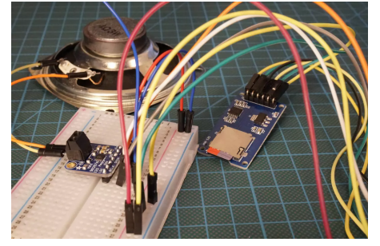

# PRACTICA 7 :  Buses de comunicación III (I2S) 

El protocolo de comunicación I2S se usa para transferir señales de sonido digitales Nosotros
realizaremos una practica para reproducir música desde la memoria interna, así como desde
una tarjeta SD externa.
También comparamos diferentes microcontroladores y vemos por qué preferimos un
microcontrolador ESP32 para nuestros proyectos I2S.

## **Hardware**
- ESP32
- MAX98357 I2S
- Tarjeta micro SD
- I2S

  
## **Objetivo**
Queremos reproducir el archivo WAVE que mencioné al principio de este tutorial a través del ESP32 NodeMCU y el altavoz. Debido a que el ESP32 tiene que leer el archivo WAVE y reenviar la señal de audio digital al MAX98357A, tenemos que usar una tarjeta SD con el archivo WAVE. 




## **Software y funcionamiento**


### **Cabecera del código**
Primero de todo se definien las librerias:
#include "Audio.h" incluye la biblioteca de Audio, que es necesaria para reproducir archivos de audio.
#include "SD.h"  incluye la biblioteca SD, que se utiliza para acceder a la tarjeta SD.
#include "FS.h"  incluye la biblioteca FS, que se utiliza para acceder al sistema de archivos de la tarjeta SD.
Posteriormente se definen los pines que se van a utilizar en el programa.

```cpp
#include <Arduino.h>
#include "Audio.h"
#include "SD.h"
#include "FS.h"

// Digital I/O used
#define SD_CS          5
#define SPI_MOSI      23
#define SPI_MISO      19
#define SPI_SCK       18
#define I2S_DOUT      25
#define I2S_BCLK      27
#define I2S_LRC       26

Audio audio; //se crea un objeto de audio

```

### **Estructura del Setup**
En la función "setup", se inicializan los pines digitales y se configura la conexión con la tarjeta SD y el objeto Audio. Se establece el pinout de I2S, el volumen y se conecta al archivo de audio "Guillermo_Sonia.wav" en la tarjeta SD.
```cpp
void setup(){
    pinMode(SD_CS, OUTPUT);
    digitalWrite(SD_CS, HIGH);
    SPI.begin(SPI_SCK, SPI_MISO, SPI_MOSI);
    Serial.begin(115200);
    SD.begin(SD_CS);
    audio.setPinout(I2S_BCLK, I2S_LRC, I2S_DOUT);
    audio.setVolume(10); // 0...21
    audio.connecttoFS(SD, "Guillermo_Sonia.wav");
}
```
### **Estructura del Loop**

La función "loop" llama al método "loop" del objeto Audio. Este método comprueba si hay datos de audio disponibles para reproducir y, si es así, los reproduce.
Las siguientes líneas son funciones opcionales que se utilizan para mostrar información sobre el audio:
```cpp
void loop(){
    audio.loop();
}

// optional
void audio_info(const char *info){
    Serial.print("info        "); Serial.println(info);
}
void audio_id3data(const char *info){  //id3 metadata
    Serial.print("id3data     ");Serial.println(info);
}
void audio_eof_mp3(const char *info){  //end of file
    Serial.print("eof_mp3     ");Serial.println(info);
}
void audio_showstation(const char *info){
    Serial.print("station     ");Serial.println(info);
}
void audio_showstreaminfo(const char *info){
    Serial.print("streaminfo  ");Serial.println(info);
}
void audio_showstreamtitle(const char *info){
    Serial.print("streamtitle ");Serial.println(info);
}
void audio_bitrate(const char *info){
    Serial.print("bitrate     ");Serial.println(info);
}
void audio_commercial(const char *info){  //duration in sec
    Serial.print("commercial  ");Serial.println(info);
}
void audio_icyurl(const char *info){  //homepage
    Serial.print("icyurl      ");Serial.println(info);
}
void audio_lasthost(const char *info){  //stream URL played
    Serial.print("lasthost    ");Serial.println(info);
}
void audio_eof_speech(const char *info){
    Serial.print("eof_speech  ");Serial.println(info);
}
```


## **Código completo**
```cpp
#include <Arduino.h>
#include "Audio.h"
#include "SD.h"
#include "FS.h"

// Digital I/O used
#define SD_CS          5
#define SPI_MOSI      23
#define SPI_MISO      19
#define SPI_SCK       18
#define I2S_DOUT      25
#define I2S_BCLK      27
#define I2S_LRC       26

Audio audio;

void setup(){
    pinMode(SD_CS, OUTPUT);
    digitalWrite(SD_CS, HIGH);
    SPI.begin(SPI_SCK, SPI_MISO, SPI_MOSI);
    Serial.begin(115200);
    SD.begin(SD_CS);
    audio.setPinout(I2S_BCLK, I2S_LRC, I2S_DOUT);
    audio.setVolume(10); // 0...21
    audio.connecttoFS(SD, "Guillermo_Sonia.wav");
}

void loop(){
    audio.loop();
}

// optional
void audio_info(const char *info){
    Serial.print("info        "); Serial.println(info);
}
void audio_id3data(const char *info){  //id3 metadata
    Serial.print("id3data     ");Serial.println(info);
}
void audio_eof_mp3(const char *info){  //end of file
    Serial.print("eof_mp3     ");Serial.println(info);
}
void audio_showstation(const char *info){
    Serial.print("station     ");Serial.println(info);
}
void audio_showstreaminfo(const char *info){
    Serial.print("streaminfo  ");Serial.println(info);
}
void audio_showstreamtitle(const char *info){
    Serial.print("streamtitle ");Serial.println(info);
}
void audio_bitrate(const char *info){
    Serial.print("bitrate     ");Serial.println(info);
}
void audio_commercial(const char *info){  //duration in sec
    Serial.print("commercial  ");Serial.println(info);
}
void audio_icyurl(const char *info){  //homepage
    Serial.print("icyurl      ");Serial.println(info);
}
void audio_lasthost(const char *info){  //stream URL played
    Serial.print("lasthost    ");Serial.println(info);
}
void audio_eof_speech(const char *info){
    Serial.print("eof_speech  ");Serial.println(info);
}
```
